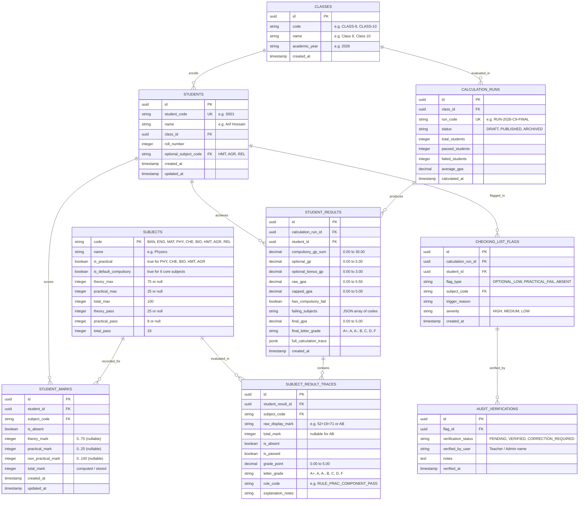

# Database Schema & Data Model (`DATA-MODEL.md`)

## 1. Overview & Architectural Principles

The School Result Processing and GPA Engine is powered by a relational schema implemented on **PostgreSQL 18** hosted on **Supabase**. The schema guarantees:
1. **Data Integrity**: Database-level check constraints enforcing mark limits (theory $0..75$, practical $0..25$, non-practical $0..100$) and valid subject codes.
2. **Audit Immutability**: Calculation runs and trace snapshots are stored in versioned tables to preserve calculation history over time.
3. **Optimized Query Performance**: Strategic indexing on `student_id`, `class_id`, `calculation_run_id`, and checking list flags for sub-millisecond retrieval in the admin dashboard.

---

## 2. Entity-Relationship Diagram (ERD)



---

## 3. Detailed Table Specifications

### 1. `classes` Table
Represents an academic cohort.

| Column | Type | Constraints | Description |
| :--- | :--- | :--- | :--- |
| `id` | `UUID` | `PRIMARY KEY DEFAULT gen_random_uuid()` | Unique class identifier |
| `code` | `VARCHAR(20)` | `UNIQUE NOT NULL` | e.g. `CLASS-9`, `CLASS-10` |
| `name` | `VARCHAR(100)` | `NOT NULL` | e.g. `Class 9`, `Class 10` |
| `academic_year` | `VARCHAR(10)` | `NOT NULL DEFAULT '2026'` | Academic session year |
| `created_at` | `TIMESTAMPTZ` | `DEFAULT clock_timestamp()` | Record creation timestamp |

### 2. `subjects` Table
Master curriculum metadata for all 9 subjects.

| Column | Type | Constraints | Description |
| :--- | :--- | :--- | :--- |
| `code` | `VARCHAR(10)` | `PRIMARY KEY` | `BAN, ENG, MAT, PHY, CHE, BIO, HMT, AGR, REL` |
| `name` | `VARCHAR(100)` | `NOT NULL` | Full subject name |
| `is_practical` | `BOOLEAN` | `NOT NULL DEFAULT FALSE` | `TRUE` for `PHY, CHE, BIO, HMT, AGR` |
| `is_default_compulsory` | `BOOLEAN` | `NOT NULL DEFAULT FALSE` | `TRUE` for 6 core compulsory subjects |
| `theory_max` | `INT` | `CHECK (theory_max = 75 OR theory_max IS NULL)` | Max theory marks |
| `practical_max` | `INT` | `CHECK (practical_max = 25 OR practical_max IS NULL)` | Max practical marks |
| `total_max` | `INT` | `NOT NULL DEFAULT 100 CHECK (total_max = 100)` | Total marks |
| `theory_pass` | `INT` | `DEFAULT 25 CHECK (theory_pass = 25 OR theory_pass IS NULL)` | Theory pass mark |
| `practical_pass` | `INT` | `DEFAULT 8 CHECK (practical_pass = 8 OR practical_pass IS NULL)` | Practical pass mark |
| `total_pass` | `INT` | `NOT NULL DEFAULT 33 CHECK (total_pass = 33)` | Passing mark |

### 3. `students` Table
Student demographic and enrolment data.

| Column | Type | Constraints | Description |
| :--- | :--- | :--- | :--- |
| `id` | `UUID` | `PRIMARY KEY DEFAULT gen_random_uuid()` | Internal unique ID |
| `student_code` | `VARCHAR(20)` | `UNIQUE NOT NULL` | Student school ID (e.g. `S001`) |
| `name` | `VARCHAR(150)` | `NOT NULL` | Student full name |
| `class_id` | `UUID` | `NOT NULL REFERENCES classes(id) ON DELETE CASCADE` | Enrolled class |
| `roll_number` | `INT` | `NOT NULL` | Class roll number |
| `optional_subject_code` | `VARCHAR(10)` | `NOT NULL REFERENCES subjects(code)` | Must be `HMT`, `AGR`, or `REL` |
| `created_at` | `TIMESTAMPTZ` | `DEFAULT clock_timestamp()` | Creation timestamp |
| `updated_at` | `TIMESTAMPTZ` | `DEFAULT clock_timestamp()` | Update timestamp |

### 4. `student_marks` Table
Raw mark entries per student per subject.

| Column | Type | Constraints | Description |
| :--- | :--- | :--- | :--- |
| `id` | `UUID` | `PRIMARY KEY DEFAULT gen_random_uuid()` | Mark entry ID |
| `student_id` | `UUID` | `NOT NULL REFERENCES students(id) ON DELETE CASCADE` | Student reference |
| `subject_code` | `VARCHAR(10)` | `NOT NULL REFERENCES subjects(code)` | Subject reference |
| `is_absent` | `BOOLEAN` | `NOT NULL DEFAULT FALSE` | `TRUE` if student was absent (`AB`) |
| `theory_mark` | `INT` | `CHECK (theory_mark BETWEEN 0 AND 75)` | Theory score |
| `practical_mark` | `INT` | `CHECK (practical_mark BETWEEN 0 AND 25)` | Practical score |
| `non_practical_mark` | `INT` | `CHECK (non_practical_mark BETWEEN 0 AND 100)` | Non-practical score |
| `total_mark` | `INT` | `CHECK (total_mark BETWEEN 0 AND 100 OR total_mark IS NULL)` | Evaluated total mark |
| `created_at` | `TIMESTAMPTZ` | `DEFAULT clock_timestamp()` | Creation timestamp |

### 5. `student_results` Table
Engine calculation results and student-level GPA summary.

| Column | Type | Constraints | Description |
| :--- | :--- | :--- | :--- |
| `id` | `UUID` | `PRIMARY KEY DEFAULT gen_random_uuid()` | Result record ID |
| `calculation_run_id` | `UUID` | `NOT NULL REFERENCES calculation_runs(id) ON DELETE CASCADE` | Calculation run context |
| `student_id` | `UUID` | `NOT NULL REFERENCES students(id) ON DELETE CASCADE` | Student reference |
| `compulsory_gp_sum` | `NUMERIC(5,2)` | `NOT NULL CHECK (compulsory_gp_sum BETWEEN 0 AND 30)` | Sum of 6 compulsory GPs |
| `optional_gp` | `NUMERIC(3,2)` | `NOT NULL CHECK (optional_gp BETWEEN 0 AND 5)` | Optional subject GP |
| `optional_bonus_gp` | `NUMERIC(3,2)` | `NOT NULL CHECK (optional_bonus_gp BETWEEN 0 AND 3)` | Bonus GP: `max(0, opt_gp - 2)` |
| `raw_gpa` | `NUMERIC(5,4)` | `NOT NULL` | Raw uncapped average |
| `capped_gpa` | `NUMERIC(3,2)` | `NOT NULL CHECK (capped_gpa BETWEEN 0 AND 5)` | Capped at 5.00 |
| `has_compulsory_fail` | `BOOLEAN` | `NOT NULL` | `TRUE` if any compulsory subject failed |
| `failing_subjects` | `JSONB` | `NOT NULL DEFAULT '[]'` | Array of failing subject codes |
| `final_gpa` | `NUMERIC(3,2)` | `NOT NULL CHECK (final_gpa BETWEEN 0 AND 5)` | Final GPA (0.00 if failed) |
| `final_letter_grade` | `VARCHAR(5)` | `NOT NULL CHECK (final_letter_grade IN ('A+','A','A-','B','C','D','F'))` | Final letter grade |
| `full_calculation_trace` | `JSONB` | `NOT NULL` | Structured step-by-step trace JSON |

### 6. `checking_list_flags` Table
Audit flags generated for office pre-publication verification.

| Column | Type | Constraints | Description |
| :--- | :--- | :--- | :--- |
| `id` | `UUID` | `PRIMARY KEY DEFAULT gen_random_uuid()` | Flag ID |
| `calculation_run_id` | `UUID` | `NOT NULL REFERENCES calculation_runs(id) ON DELETE CASCADE` | Calculation run |
| `student_id` | `UUID` | `NOT NULL REFERENCES students(id) ON DELETE CASCADE` | Flagged student |
| `flag_type` | `VARCHAR(30)` | `NOT NULL CHECK (flag_type IN ('OPTIONAL_LOW', 'PRACTICAL_FAIL', 'ABSENT'))` | Rule category |
| `subject_code` | `VARCHAR(10)` | `NOT NULL REFERENCES subjects(code)` | Triggering subject |
| `trigger_reason` | `TEXT` | `NOT NULL` | Human-readable explanation |
| `severity` | `VARCHAR(10)` | `NOT NULL DEFAULT 'HIGH'` | `HIGH, MEDIUM, LOW` |

---

## 4. PostgreSQL DDL Migration Script

```sql
-- Enable UUID extension
CREATE EXTENSION IF NOT EXISTS "uuid-ossp";

-- 1. Create Classes Table
CREATE TABLE classes (
    id UUID PRIMARY KEY DEFAULT gen_random_uuid(),
    code VARCHAR(20) UNIQUE NOT NULL,
    name VARCHAR(100) NOT NULL,
    academic_year VARCHAR(10) NOT NULL DEFAULT '2026',
    created_at TIMESTAMPTZ DEFAULT clock_timestamp()
);

-- 2. Create Subjects Master Table
CREATE TABLE subjects (
    code VARCHAR(10) PRIMARY KEY,
    name VARCHAR(100) NOT NULL,
    is_practical BOOLEAN NOT NULL DEFAULT FALSE,
    is_default_compulsory BOOLEAN NOT NULL DEFAULT FALSE,
    theory_max INT CHECK (theory_max = 75 OR theory_max IS NULL),
    practical_max INT CHECK (practical_max = 25 OR practical_max IS NULL),
    total_max INT NOT NULL DEFAULT 100 CHECK (total_max = 100),
    theory_pass INT DEFAULT 25 CHECK (theory_pass = 25 OR theory_pass IS NULL),
    practical_pass INT DEFAULT 8 CHECK (practical_pass = 8 OR practical_pass IS NULL),
    total_pass INT NOT NULL DEFAULT 33 CHECK (total_pass = 33)
);

-- 3. Seed Subjects Master
INSERT INTO subjects (code, name, is_practical, is_default_compulsory, theory_max, practical_max, theory_pass, practical_pass) VALUES
('BAN', 'Bangla', FALSE, TRUE, NULL, NULL, NULL, NULL),
('ENG', 'English', FALSE, TRUE, NULL, NULL, NULL, NULL),
('MAT', 'Mathematics', FALSE, TRUE, NULL, NULL, NULL, NULL),
('PHY', 'Physics', TRUE, TRUE, 75, 25, 25, 8),
('CHE', 'Chemistry', TRUE, TRUE, 75, 25, 25, 8),
('BIO', 'Biology', TRUE, TRUE, 75, 25, 25, 8),
('HMT', 'Higher Mathematics', TRUE, FALSE, 75, 25, 25, 8),
('AGR', 'Agriculture', TRUE, FALSE, 75, 25, 25, 8),
('REL', 'Religion', FALSE, FALSE, NULL, NULL, NULL, NULL)
ON CONFLICT (code) DO NOTHING;

-- 4. Create Students Table
CREATE TABLE students (
    id UUID PRIMARY KEY DEFAULT gen_random_uuid(),
    student_code VARCHAR(20) UNIQUE NOT NULL,
    name VARCHAR(150) NOT NULL,
    class_id UUID NOT NULL REFERENCES classes(id) ON DELETE CASCADE,
    roll_number INT NOT NULL,
    optional_subject_code VARCHAR(10) NOT NULL REFERENCES subjects(code),
    created_at TIMESTAMPTZ DEFAULT clock_timestamp(),
    updated_at TIMESTAMPTZ DEFAULT clock_timestamp(),
    CONSTRAINT chk_optional_subject CHECK (optional_subject_code IN ('HMT', 'AGR', 'REL'))
);

-- 5. Create Student Marks Table
CREATE TABLE student_marks (
    id UUID PRIMARY KEY DEFAULT gen_random_uuid(),
    student_id UUID NOT NULL REFERENCES students(id) ON DELETE CASCADE,
    subject_code VARCHAR(10) NOT NULL REFERENCES subjects(code),
    is_absent BOOLEAN NOT NULL DEFAULT FALSE,
    theory_mark INT CHECK (theory_mark BETWEEN 0 AND 75),
    practical_mark INT CHECK (practical_mark BETWEEN 0 AND 25),
    non_practical_mark INT CHECK (non_practical_mark BETWEEN 0 AND 100),
    total_mark INT CHECK (total_mark BETWEEN 0 AND 100 OR total_mark IS NULL),
    created_at TIMESTAMPTZ DEFAULT clock_timestamp(),
    CONSTRAINT uq_student_subject UNIQUE (student_id, subject_code)
);

-- 6. Create Calculation Runs Table
CREATE TABLE calculation_runs (
    id UUID PRIMARY KEY DEFAULT gen_random_uuid(),
    class_id UUID NOT NULL REFERENCES classes(id) ON DELETE CASCADE,
    run_code VARCHAR(50) UNIQUE NOT NULL,
    status VARCHAR(20) NOT NULL DEFAULT 'DRAFT' CHECK (status IN ('DRAFT', 'PUBLISHED', 'ARCHIVED')),
    total_students INT NOT NULL DEFAULT 0,
    passed_students INT NOT NULL DEFAULT 0,
    failed_students INT NOT NULL DEFAULT 0,
    average_gpa NUMERIC(3,2) NOT NULL DEFAULT 0.00,
    calculated_at TIMESTAMPTZ DEFAULT clock_timestamp()
);

-- 7. Create Student Results Table
CREATE TABLE student_results (
    id UUID PRIMARY KEY DEFAULT gen_random_uuid(),
    calculation_run_id UUID NOT NULL REFERENCES calculation_runs(id) ON DELETE CASCADE,
    student_id UUID NOT NULL REFERENCES students(id) ON DELETE CASCADE,
    compulsory_gp_sum NUMERIC(5,2) NOT NULL,
    optional_gp NUMERIC(3,2) NOT NULL,
    optional_bonus_gp NUMERIC(3,2) NOT NULL,
    raw_gpa NUMERIC(5,4) NOT NULL,
    capped_gpa NUMERIC(3,2) NOT NULL,
    has_compulsory_fail BOOLEAN NOT NULL,
    failing_subjects JSONB NOT NULL DEFAULT '[]',
    final_gpa NUMERIC(3,2) NOT NULL,
    final_letter_grade VARCHAR(5) NOT NULL CHECK (final_letter_grade IN ('A+','A','A-','B','C','D','F')),
    full_calculation_trace JSONB NOT NULL,
    created_at TIMESTAMPTZ DEFAULT clock_timestamp(),
    CONSTRAINT uq_run_student UNIQUE (calculation_run_id, student_id)
);

-- 8. Create Checking List Flags Table
CREATE TABLE checking_list_flags (
    id UUID PRIMARY KEY DEFAULT gen_random_uuid(),
    calculation_run_id UUID NOT NULL REFERENCES calculation_runs(id) ON DELETE CASCADE,
    student_id UUID NOT NULL REFERENCES students(id) ON DELETE CASCADE,
    flag_type VARCHAR(30) NOT NULL CHECK (flag_type IN ('OPTIONAL_LOW', 'PRACTICAL_FAIL', 'ABSENT')),
    subject_code VARCHAR(10) NOT NULL REFERENCES subjects(code),
    trigger_reason TEXT NOT NULL,
    severity VARCHAR(10) NOT NULL DEFAULT 'HIGH' CHECK (severity IN ('HIGH', 'MEDIUM', 'LOW')),
    created_at TIMESTAMPTZ DEFAULT clock_timestamp()
);

-- 9. Create Audit Verifications Table
CREATE TABLE audit_verifications (
    id UUID PRIMARY KEY DEFAULT gen_random_uuid(),
    flag_id UUID NOT NULL REFERENCES checking_list_flags(id) ON DELETE CASCADE,
    verification_status VARCHAR(30) NOT NULL DEFAULT 'PENDING' CHECK (verification_status IN ('PENDING', 'VERIFIED', 'CORRECTION_REQUIRED')),
    verified_by_user VARCHAR(100) NOT NULL,
    notes TEXT,
    verified_at TIMESTAMPTZ DEFAULT clock_timestamp()
);

-- Indexes for lightning fast queries
CREATE INDEX idx_students_class ON students(class_id);
CREATE INDEX idx_marks_student ON student_marks(student_id);
CREATE INDEX idx_results_run ON student_results(calculation_run_id);
CREATE INDEX idx_results_student ON student_results(student_id);
CREATE INDEX idx_flags_run ON checking_list_flags(calculation_run_id);
CREATE INDEX idx_flags_type ON checking_list_flags(flag_type);
```
