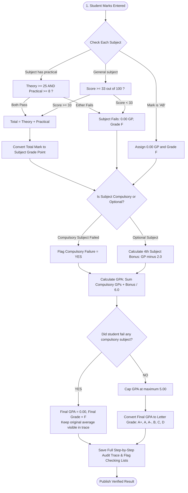

# Grading Rules & Business Logic Guide (`RULES.md`)

## 1. Overview & How It Works

This document describes all the grading rules used in the school result calculation engine in simple, plain terms. Every rule has an official code (like `R-11` or `R-13`) that is recorded in the calculation history so teachers and students can clearly understand how each result was reached.

### Result Calculation Flow



---

## 2. The Core Rules Explained Simply

### Rule `R-11`: Passing Practical Subjects
* **Applies to**: Physics (`PHY`), Chemistry (`CHE`), Biology (`BIO`), Higher Math (`HMT`), Agriculture (`AGR`).
* **The Rule**: A student must pass **both parts independently**:
  1. Theory score must be at least **25 out of 75**.
  2. Practical score must be at least **8 out of 25**.
* **Why this matters**:
  - If a student gets **65 in theory** but only **7 in practical**, they **fail the entire subject** (0.00 GP, Grade F).
  - Even though their combined mark is $65 + 7 = 72$ (which normally looks like an "A"), failing the practical part fails the subject.
  - Trace Code: `RULE_PRAC_COMPONENT_FAIL` or `RULE_THEORY_COMPONENT_FAIL`.

---

### Rule `R-07`: Passing General (Non-Practical) Subjects
* **Applies to**: Bangla (`BAN`), English (`ENG`), Mathematics (`MAT`), Religion (`REL`).
* **The Rule**: The student must score at least **33 out of 100** to pass.
* If the score is less than 33, the subject grade is **F** (GP 0.00).

---

### Rule `R-12`: Handling Absences (`AB`)
* If a student misses an exam, their mark is recorded as `"AB"` (not converted to a number 0).
* **Absent in a Compulsory Subject**:
  - The subject grade is **F** (0.00 GP).
  - This immediately fails the student overall (Final GPA = 0.00, Grade F).
  - The student is flagged on the **Absentee Review List**.
  - Trace Code: `RULE_ABSENT_COMPULSORY`.
* **Absent in an Optional Subject**:
  - The optional subject gets 0.00 GP and contributes 0.00 bonus points.
  - It does **not** fail the entire exam as long as all 6 compulsory subjects are passed.
  - Trace Code: `RULE_ABSENT_OPTIONAL`.

---

### Rule `R-21`: Marks to Subject Grade Points
When a subject passes, the total marks map directly to Grade Points and Letter Grades:

| Marks Range | Grade Point (GP) | Subject Letter Grade | Description | Trace Code |
| :---: | :---: | :---: | :--- | :--- |
| **80 – 100** | **5.0** | **A+** | Outstanding | `RULE_SUB_GRADE_A_PLUS` |
| **70 – 79** | **4.0** | **A** | Very Good | `RULE_SUB_GRADE_A` |
| **60 – 69** | **3.5** | **A-** | Good | `RULE_SUB_GRADE_A_MINUS` |
| **50 – 59** | **3.0** | **B** | Satisfactory | `RULE_SUB_GRADE_B` |
| **40 – 49** | **2.0** | **C** | Acceptable / Pass | `RULE_SUB_GRADE_C` |
| **33 – 39** | **1.0** | **D** | Marginal Pass | `RULE_SUB_GRADE_D` |
| **0 – 32** (or failed component / AB) | **0.0** | **F** | Fail | `RULE_SUB_GRADE_F` |

---

### Rule `R-20`: Optional 4th Subject Bonus Points
* Students take one optional subject (Higher Math, Agriculture, or Religion).
* Only grade points **above 2.00** count as bonus:
  $$\text{Bonus Points} = \max(0, \text{Optional GP} - 2.00)$$
* **How it works**:
  - Optional GP = 5.0 $\implies 5.0 - 2.0 = \mathbf{3.0}$ bonus points added to total.
  - Optional GP = 4.0 $\implies 4.0 - 2.0 = \mathbf{2.0}$ bonus points added to total.
  - Optional GP = 3.5 $\implies 3.5 - 2.0 = \mathbf{1.5}$ bonus points added to total.
  - Optional GP = 3.0 $\implies 3.0 - 2.0 = \mathbf{1.0}$ bonus point added to total.
  - Optional GP = 2.0 or less $\implies \mathbf{0.0}$ bonus points (no bonus).
* **Important**: The divisor in the GPA formula always remains **6.0** (the number of compulsory subjects).

---

### Rule `R-13`: GPA Calculation & Compulsory Failure Override
1. **Add up Compulsory GPs**: Sum the grade points of the 6 compulsory subjects.
2. **Add Bonus Points**: Add any extra points earned from the optional 4th subject.
3. **Divide by 6**: Calculate the raw GPA by dividing by 6.0:
   $$\text{Raw GPA} = \frac{\text{Sum of 6 Compulsory GPs} + \text{Optional Bonus Points}}{6.0}$$
4. **Cap at 5.00**: The maximum GPA possible is 5.00. Any number above 5.00 (e.g. 5.50) is capped at 5.00.
5. **Compulsory Failure Override**:
   - If a student fails **any one** of the 6 compulsory subjects (score $< 33$, failed theory, failed practical, or absent):
     - **Final GPA = 0.00**
     - **Final Letter Grade = F**
   - The original raw GPA is preserved and clearly shown in the audit trace so teachers know what the uncancelled average was.

---

### Rule `R-10`: Final GPA to Overall Letter Grade

| Final GPA Range | Letter Grade | Result Status |
| :---: | :---: | :--- |
| **5.00** | **A+** | Passed with Highest Distinction |
| **4.00 – 4.99** | **A** | Passed |
| **3.50 – 3.99** | **A-** | Passed |
| **3.00 – 3.49** | **B** | Passed |
| **2.00 – 2.99** | **C** | Passed |
| **1.00 – 1.99** | **D** | Passed |
| **0.00** (or any compulsory fail) | **F** | Failed |

---

### Rule `R-29`: Pre-Publication Verification Lists

Before results are published to students and parents, the system groups edge cases into 3 review queues for administrators to check:

| Review List | Who is on this list? | Why staff checks this list |
| :--- | :--- | :--- |
| **1. Optional Subject Review** | Students with an Optional GP $\le 2.00$ (or absent) | Make sure optional marks were not entered incorrectly or left blank by mistake. |
| **2. Practical Fail Review** | Any student who scored $< 8$ in practical | Check for clerical typos (e.g., entering "7" instead of "17"). |
| **3. Absentee Review** | Any student marked `"AB"` in any subject | Verify against official examination hall sign-in sheets. |
| **Multi-Flag Summary** | Students meeting two or more of the above conditions | High priority review cases requiring administrative sign-off. |

---

## 3. Simple Logic in Code (Pseudocode)

Here is how the calculation engine runs in clear TypeScript logic:

```typescript
// 1. Evaluate a single subject
function evaluateSubject(mark, isPractical, isCompulsory) {
  // Check absence
  if (mark === "AB") {
    return { gp: 0.0, grade: "F", isPassed: false, reason: "Absent from exam" };
  }

  // Check practical subject components
  if (isPractical) {
    if (mark.theory < 25) {
      return { gp: 0.0, grade: "F", isPassed: false, reason: "Theory score below 25" };
    }
    if (mark.practical < 8) {
      return { gp: 0.0, grade: "F", isPassed: false, reason: "Practical score below 8" };
    }
    const total = mark.theory + mark.practical;
    return getGradePoint(total);
  }

  // Check general subject
  if (mark < 33) {
    return { gp: 0.0, grade: "F", isPassed: false, reason: "Total score below 33" };
  }
  return getGradePoint(mark);
}

// 2. Calculate complete student GPA
function calculateStudentGPA(compulsorySubjects, optionalSubject) {
  let compulsoryGPsSum = 0;
  let hasCompulsoryFail = false;

  for (const sub of compulsorySubjects) {
    compulsoryGPsSum += sub.gp;
    if (!sub.isPassed) {
      hasCompulsoryFail = true;
    }
  }

  // Optional 4th subject bonus: points above 2.00
  const bonusPoints = Math.max(0, optionalSubject.gp - 2.0);

  // Divide by 6.0
  const rawGPA = (compulsoryGPsSum + bonusPoints) / 6.0;
  const cappedGPA = Math.min(5.0, rawGPA);

  // If any compulsory subject failed, final GPA is 0.00 / F
  if (hasCompulsoryFail) {
    return {
      rawGPA: rawGPA,
      finalGPA: 0.0,
      finalGrade: "F",
      status: "FAILED"
    };
  }

  return {
    rawGPA: rawGPA,
    finalGPA: cappedGPA,
    finalGrade: getFinalLetterGrade(cappedGPA),
    status: "PASSED"
  };
}
```
