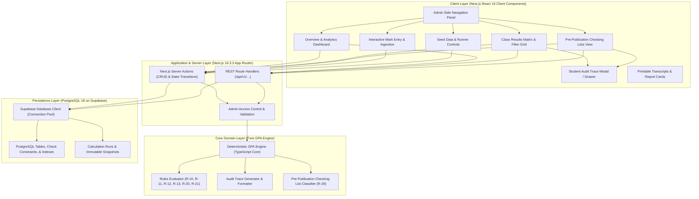
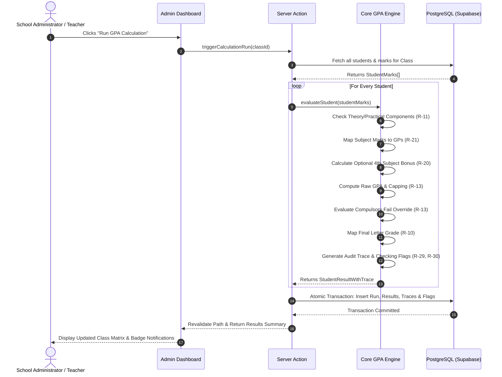

# System Architecture Specification (`SYSTEM-ARCHITECTURE.md`)

## 1. Architectural Vision & High-Level Topology

The School Result Processing and GPA Engine is structured as a modern, unified fullstack application built with **Next.js 16.3.3** and **PostgreSQL 18** on **Supabase**. The system prioritizes deterministic rule execution, absolute transparency through audit tracing, sub-second query performance, and a rich, accessible administrative dashboard.



---

## 2. Layered Architecture Breakdown

### 1. Presentation & Client Layer (Next.js App Router)
- **Side Panel Navigation**: Persistent, responsive sidebar with active route indicator, collapsible drawer for mobile/tablet, and live badge counters for flagged verification cases.
- **Class Results Matrix**: High-performance data table displaying student lists, individual subject marks, grade points, overall GPA, letter grades, and quick-action trigger buttons.
- **Audit Trace Drawer**: Slide-over drawer providing immediate, human-readable step-by-step calculation traces when inspecting any student result.
- **Checking Lists Hub**: Interactive tabbed workspace displaying the 3 pre-publication lists (`Optional <= 2.0`, `Practical Fail < 8`, `Absentee AB`) plus a `Multi-Flag` consolidated view. Allows teachers to record sign-off notes and verification statuses.

### 2. Application & API Layer (Next.js Server Actions & Route Handlers)
- **Server Actions**: Type-safe mutations for updating marks, triggering batch calculation runs, resolving checking list flags, and re-seeding demo data.
- **Route Handlers (`/api/v1/...`)**: REST endpoints for programmatic access, automated grading verification benchmarks, and JSON exports.
- **Zod Validation**: Strict runtime schema validation on all inputs before passing to the domain engine or database.

### 3. Core Domain Layer (Pure GPA Engine)
- **Zero External Dependencies**: The GPA Engine is implemented as a standalone, pure TypeScript library with zero database or framework coupling.
- **Mathematical Determinism**: Guarantees identical outputs for identical inputs across web browsers, Node.js runtime, and automated testing suites.
- **Integrated Audit Generation**: The engine produces both the mathematical outcome and the structured audit trail in a single atomic evaluation step.

### 4. Persistence Layer (PostgreSQL 18 on Supabase)
- **Connection Pooling**: Uses Supabase transaction pooler for fast, resilient database operations.
- **Check Constraints**: Database enforces business rules at the storage tier (e.g. `theory_mark BETWEEN 0 AND 75`).
- **Transactional Consistency**: Calculation runs write student results, subject traces, and checking flags in a single ACID database transaction.

---

## 3. Core Engine Data Flow & Lifecycle



---

## 4. UI Component Hierarchy & Routing Structure

```
src/
├── app/
│   ├── layout.tsx                    # Root layout with sidebar provider & theme
│   ├── page.tsx                      # Dashboard redirect
│   ├── dashboard/
│   │   ├── page.tsx                  # Overview & metric cards
│   │   ├── results/
│   │   │   ├── page.tsx              # Class 9 & Class 10 Results Matrix
│   │   │   └── [studentId]/page.tsx  # Detailed student transcript & trace
│   │   ├── checking-lists/
│   │   │   ├── page.tsx              # Pre-publication checking list tabs
│   │   │   ├── optional/page.tsx     # Optional <= 2.0 list
│   │   │   ├── practical/page.tsx    # Practical fail < 8 list
│   │   │   ├── absent/page.tsx       # Absentee AB list
│   │   │   └── multi-flag/page.tsx   # Multi-flag summary
│   │   ├── marks-entry/
│   │   │   └── page.tsx              # Grade sheet entry & bulk upload
│   │   ├── seed-data/
│   │   │   └── page.tsx              # Demo dataset manager & 8 edge-case suite
│   │   └── reports/
│   │       └── page.tsx              # Printable transcripts & export
│   └── api/
│       └── v1/
│           ├── engine/calculate/route.ts
│           ├── results/route.ts
│           ├── checking-lists/route.ts
│           └── seed/route.ts
├── components/
│   ├── layout/
│   │   ├── Sidebar.tsx               # Persistent admin navigation
│   │   ├── Header.tsx                # Breadcrumbs, class selector & actions
│   │   └── Shell.tsx                 # Responsive page shell
│   ├── dashboard/
│   │   ├── MetricCards.tsx           # Pass rate, GPA distribution chart
│   │   ├── ClassSelector.tsx         # Class 9 / Class 10 switcher
│   │   └── EdgeCaseAlerts.tsx        # High-visibility warning banner
│   ├── results/
│   │   ├── ResultsTable.tsx          # Interactive matrix with filtering/search
│   │   ├── GradeBadge.tsx            # Styled badge (A+, A, B, C, D, F)
│   │   └── TraceDrawer.tsx           # Step-by-step audit slideover
│   ├── checking-lists/
│   │   ├── CheckingTabs.tsx          # Tab switcher with count badges
│   │   ├── FlaggedStudentTable.tsx   # Filtered edge-case table
│   │   └── VerificationModal.tsx     # Teacher sign-off & notes modal
│   └── common/
│       ├── Button.tsx
│       ├── Modal.tsx
│       └── Badge.tsx
├── engine/
│   ├── types.ts                      # Domain models & trace definitions
│   ├── rules.ts                      # Pure rule functions (R-10 to R-29)
│   ├── calculator.ts                 # Student & class calculation orchestrator
│   ├── trace.ts                      # Trace formatting & narrative builder
│   └── __tests__/                    # Vitest unit test suite (100% rule coverage)
├── lib/
│   ├── db.ts                         # Supabase database client
│   └── utils.ts                      # Rounding, formatting, CSV export
└── types/
    └── database.types.ts             # Supabase generated database types
```

---

## 5. Security, Validation & Reliability

1. **Strict Input Sanitization**: All mark inputs are validated against strict Zod schemas preventing out-of-bound numbers (e.g. practical marks > 25 or theory marks > 75).
2. **Transaction Isolation**: Calculation runs are committed atomically using PostgreSQL transactions. If an error occurs midway, no partial results are published.
3. **Audit Trail Immutability**: Historical calculation runs are immutable; re-running calculations creates a new timestamped version without overwriting prior audit records.
4. **Accessible Design**: Complies with WCAG 2.1 AA with proper ARIA attributes, semantic HTML5, high-contrast text, and responsive viewport support.
